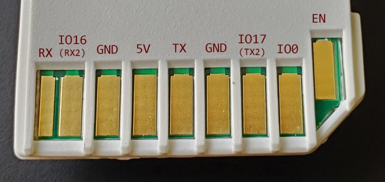

# Miro Humidifier ESPHome (miroT)

## Overview
ESPHome firmware for the ESP32-based miroT module for Miro Humidifiers. This could also be used to DIY an ESP32 module with an SD card interface.

## Features:
  - Humidifier device power on/off
  - Humidifier output level
  - Sound on/off
  - Low water reporting
  - RGB light control

## Supported Models
- NR08M

## Pinout
The miroT module uses an SD card form factor with the following pin mapping

| SD | miroT / ESP32 |
|----|---------------|
| 9  | EN            |
| 1  | IO0           |
| 2  | IO17 (TX2)    |
| 3  | GND           |
| 4  | TX            |
| 5  | 5V            |
| 6  | GND           |
| 7  | IO16 (RX2)    |
| 8  | EN            |

## Flashing ESPHome
### Software
Update the values in `miro_humidifier.yaml` under the `wifi:` section to match your access point SSID and password.

Update the `display_name` and `esphome:` name if needed.

### Hardware
You'll need a way to connect `TX`, `RX`, `5V`, and `GND` to a serial adapter. I plugged the module into an SD card extender and soldered wires to the pins on the slot. It may be possible to solder to the PCB directly, I didn't crack mine open to see if there was a programming header.

You can follow the [ESPHome connection guide](https://esphome.io/guides/physical_device_connection.html) and the [flashing guide](https://esphome.io/guides/getting_started_command_line) to flash `miro_humidifier.yaml` to the device.